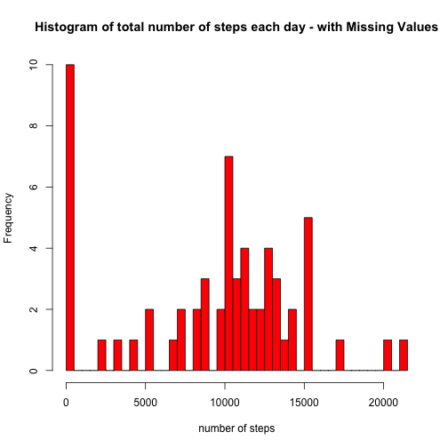
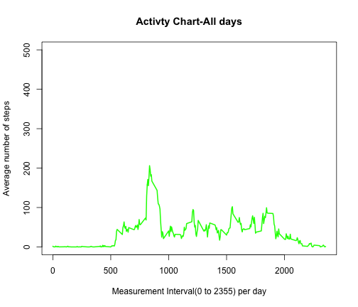
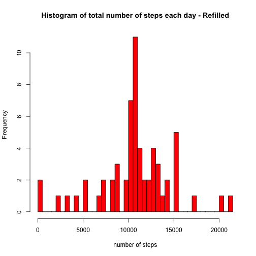

Reproducible Research: Peer Assesment 1
========================================================

## Read in the data

```r
dataF <- read.csv("activity.csv");
str(dataF)
```

```
## 'data.frame':	17568 obs. of  3 variables:
##  $ steps   : int  NA NA NA NA NA NA NA NA NA NA ...
##  $ date    : Factor w/ 61 levels "2012-10-01","2012-10-02",..: 1 1 1 1 1 1 1 1 1 1 ...
##  $ interval: int  0 5 10 15 20 25 30 35 40 45 ...
```

## Part 1: What is mean total number of steps taken per day?

```r
days<-levels(dataF$date);
numStepsPerDay=list();
for ( day in days ) {
  
  rawStepsPerDay <- dataF$steps[ day == dataF$date ];
  measuredStepsPerDay <- rawStepsPerDay[ which( !is.na( rawStepsPerDay ) ) ];
  numStepsPerDay <- c( numStepsPerDay, sum( measuredStepsPerDay ) );
 
}
# make histogram for number of steps taken per day
#daysInFormat<-strptime(days, "%Y-%m-%d");
hist(as.numeric(numStepsPerDay), breaks = 50, col = "red",
     main = "Histogram of total number of steps each day - with Missing Values",
     xlab = "number of steps", ylab = "Frequency")
```

 

#### Average number of steps per day:

```r
mean(as.numeric(numStepsPerDay))
```

```
## [1] 9354
```

#### Median number of steps per day:

```r
median(as.numeric(numStepsPerDay))
```

```
## [1] 10395
```


## Part 2: What is the average daily activity pattern?

```r
perDayIntervalVector = unique(dataF$interval);

meanStepsPerInterval=list();
for( intrvl in perDayIntervalVector ){
  
  rawStepsPerInterval <- dataF$steps[ which( dataF$interval == intrvl ) ];
  measuredStepsPerInterval <- rawStepsPerInterval[ which( !is.na( rawStepsPerInterval ) ) ];
  meanStepsPerInterval <- c( meanStepsPerInterval, mean( measuredStepsPerInterval ) );
  
}
```


```r
plot(
  perDayIntervalVector, 
  meanStepsPerInterval,
  type="l", 
  xlab= "Measurement Interval(0 to 2355) per day", 
  ylab= "Average number of steps",
  main= "Activty Chart-All days",
  col="green",
  lwd=2, ylim=c(0,500))
```

 

#### Which 5-minute interval, on average across all the days in the dataset, contains the maximum number of steps?

```r
perDayIntervalVector[which.max(as.numeric(meanStepsPerInterval))]
```

```
## [1] 835
```


## Part 3: Inputing missing values

#### Total number of Missing(NA) rows:

```r
totalMissingRows<-sum(is.na(dataF$steps) | is.na(dataF$interval) | is.na(dataF$date));
```

#### Filling missing values with a simple stretegy
we have used a mean value of the 5 minute interval of steps measurement to replace the NA step measurements.


```r
dataReFilled<-dataF;
indicesNASteps<-which(is.na(dataF$steps));
for( iInd in indicesNASteps) {
  valueToFill<-meanStepsPerInterval[which(perDayIntervalVector==dataReFilled$interval[iInd])];
  dataReFilled$steps[iInd] <- round(as.numeric(valueToFill));
}
```

#### Now creating the histogram again with the new "NA filled" dataset.

```r
# redo the histogram and mean median estimations
numStepsPerDayRefilled=list();
for ( day in days ) {
  
  rawStepsPerDay <- dataReFilled$steps[ day == dataReFilled$date ];
  measuredStepsPerDay <- rawStepsPerDay[ which( !is.na( rawStepsPerDay ) ) ];
  numStepsPerDayRefilled <- c( numStepsPerDayRefilled, sum( measuredStepsPerDay ) );
  
}
hist(as.numeric(numStepsPerDayRefilled), breaks = 50, col = "red",
     main = "Histogram of total number of steps each day - Refilled",
     xlab = "number of steps", ylab = "Frequency")
```

 


#### Average number of steps per day after filling the missing values:

```r
mean(as.numeric(numStepsPerDayRefilled))
```

```
## [1] 10766
```

#### Median number of steps per day after filling the missing values:

```r
median(as.numeric(numStepsPerDayRefilled))
```

```
## [1] 10762
```

Do these values differ from the estimates from the first part of the assignment? What is the impact of imputing missing data on the estimates of the total daily number of steps?

Answer: Yes there is a differnce in the first histogram (created with missing values)  and the the second histogram (missing values filled in with a simple stretegy). In the first histogram the missing step measurements were contributing to the 0 step bins in the histogram (therefore the peak), filling the missing values basically moves the peak from 0 step bin to 10762 step bin.   

## Part 4: Are there differences in activity patterns between weekdays and weekends?

Creating a new factor variable for with two levels weekday and weekend


```r
dateToDayVec<-weekdays(strptime(dataF$date, format= "%Y-%m-%d"))

IsItWeekend<-function(x){
  if( x == "Monday" || x == "Tuesday" || x == "Wednesday" || x == "Thursday" || x == "Friday" ) {
    x<-0
  }
  else {
    x<-1
  }
}

dataF$DayCategory <-factor(as.numeric(lapply(dateToDayVec, IsItWeekend)), labels=c("weekday","weekend"));
```

Plotting the "average steps per interval" for weekdays (red colored profile), and "average steps per interval" for weekend (green colored profile).


```r
meanStepsPerIntervalWeekDay=list();
meanStepsPerIntervalWeekEnd=list();
for( intrvl in perDayIntervalVector ){
  
  rawStepsPerInterval <- dataF$steps[ which( dataF$interval == intrvl & dataF$DayCategory == "weekday" ) ];
  measuredStepsPerInterval <- rawStepsPerInterval[ which( !is.na( rawStepsPerInterval ) ) ];
  meanStepsPerIntervalWeekDay <- c( meanStepsPerIntervalWeekDay, mean( measuredStepsPerInterval ) );
 
  rawStepsPerInterval <- dataF$steps[ which( dataF$interval == intrvl & dataF$DayCategory == "weekend" )];
  measuredStepsPerInterval <- rawStepsPerInterval[ which( !is.na( rawStepsPerInterval ) ) ];
  meanStepsPerIntervalWeekEnd <- c( meanStepsPerIntervalWeekEnd, mean( measuredStepsPerInterval ) );
}

plot(
  perDayIntervalVector, 
  meanStepsPerIntervalWeekDay,
  type="l", 
  xlab= "Measurement Intervals (0 to 2355) per day", 
  ylab= "Average number of steps",
  main= "Activty Chart \n(Weekday:Green, Weekend:Red)",
  col="Red",
  lwd=2,
  ylim=c(0,500))

lines(
  perDayIntervalVector, 
  meanStepsPerIntervalWeekEnd,
  type="l", 
  xlab= "Measurement Intervals (0 to 2355) per day", 
  ylab= "Average number of steps",
  col="Green",
  lwd=2,
  ylim=c(0,500))
```

 

* Analysis of difference between activity during weekday and weekend:
  + There are obvious differences between the weekdays and weekends in terms of the amount of activity.
  + On average there is lower amount of activity in the weekend mornings.
  + There is a peak in activity in the morning around 08:35 am. 
  + There appears to be less activity from 10:00 to 18:00 during the weekdays, I am assuming the data is for    a person with an office job. 


